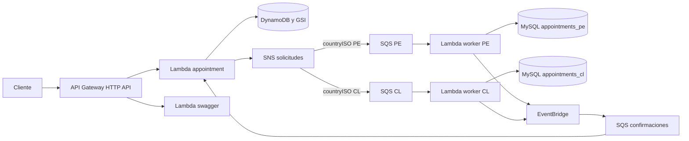
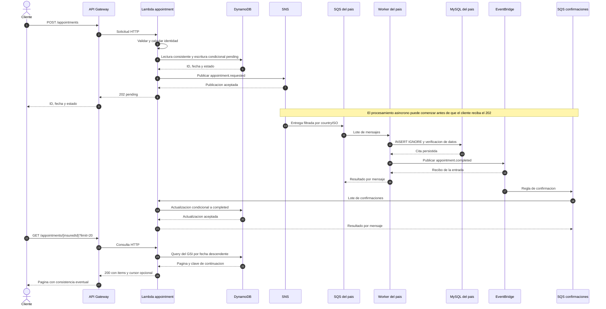

# Documentación técnica

## Alcance

El servicio recibe solicitudes de citas de asegurados de Perú y Chile. Guarda la solicitud en DynamoDB con estado `pending`, la procesa en el worker del país correspondiente y registra el resultado en MySQL. Una confirmación por eventos actualiza DynamoDB a `completed`.

El cliente consulta el estado mediante HTTP. `202` indica que se aceptó el procesamiento; la confirmación se conoce consultando el GET o repitiendo la misma reserva después de completarse. `scheduleId` identifica un horario externo: este servicio no resuelve disponibilidad, conflictos de agenda, cancelaciones ni datos de pacientes.

La infraestructura está definida para el entorno `learning` en `us-east-1`. La persistencia SQL del entorno usa Aiven MySQL externo, con una base por país. El proyecto no crea RDS ni Aurora. El entorno está destinado a datos ficticios.

## Stack

| Área                | Tecnología en el repositorio                            | Uso                                                                            |
| ------------------- | ------------------------------------------------------- | ------------------------------------------------------------------------------ |
| Ejecución           | Node.js 24.19.0; Lambda `nodejs24.x`                    | Runtime local y de las funciones                                               |
| Lenguaje y paquetes | TypeScript 6.0.3; pnpm 11.21.0                          | Tipos estrictos, alias `@` y dependencias fijadas por lockfile                 |
| Validación          | Zod 4.6.5                                               | Contratos HTTP, mensajes, secretos y esquemas OpenAPI                          |
| Clientes AWS        | AWS SDK v3, paquetes 3.1144.0                           | DynamoDB, SNS, EventBridge y Secrets Manager; CloudFormation para herramientas |
| Persistencia SQL    | mysql2 3.24.5                                           | Consultas parametrizadas y pools con TLS                                       |
| Base SQL            | MySQL 8.4 en Aiven; MySQL 8.0 en Compose                | Persistencia externa y pruebas de integración locales                          |
| Infraestructura     | Serverless Framework 4.43.0; CloudFormation             | Lambdas, API, tabla, colas, tópicos, roles y alarmas                           |
| Artefactos          | esbuild 0.28.2; fflate 0.8.3                            | Bundles CommonJS y empaquetado ZIP                                             |
| Documentación HTTP  | OpenAPI 3.1; Swagger UI 5.33.1                          | Especificación y consola de consulta                                           |
| Pruebas             | Jest 30.5.2, ts-jest 29.4.14, aws-sdk-client-mock 4.1.0 | Pruebas unitarias e integración                                                |
| Herramientas        | tsx, ESLint, Prettier, Docker Compose, mise             | Scripts TypeScript, calidad, formato y entorno local                           |
| Observabilidad      | Powertools Logger 2.35.0; CloudWatch; SNS               | Logs estructurados, métricas, alarmas y correo                                 |
| Automatización      | GitHub Actions, OIDC, SonarQube Cloud y Snyk            | CI, análisis, seguridad de dependencias y despliegue manual                    |

Las versiones de paquetes se consultan en [package.json](../package.json) y [pnpm-lock.yaml](../pnpm-lock.yaml). [mise.toml](../mise.toml) fija Node local; Lambda utiliza la versión gestionada de la familia Node 24. [compose.yml](../compose.yml) usa las imágenes `mysql:8.0` y `amazon/dynamodb-local:latest`, que no están fijadas por digest.

## Organización y patrones

La estructura sigue arquitectura hexagonal y la dirección de dependencias de Clean Architecture: los casos de uso dependen de contratos de la aplicación y tipos del dominio. AWS, MySQL y HTTP se conectan mediante adaptadores.

| Carpeta              | Responsabilidad                                                | Ejemplo                                                                                                                                           |
| -------------------- | -------------------------------------------------------------- | ------------------------------------------------------------------------------------------------------------------------------------------------- |
| `src/domain`         | Tipos, estados e identidad de la cita                          | [Identidad determinista](../src/domain/appointments/helpers/identity.ts)                                                                          |
| `src/application`    | Casos de uso y puertos que requieren                           | [Registro](../src/application/appointments/use-cases/create.ts), [puertos de persistencia](../src/application/appointments/ports/repositories.ts) |
| `src/infrastructure` | Validación de entradas, HTTP, SQS, clientes AWS y persistencia | [Repositorio DynamoDB](../src/infrastructure/persistence/dynamo/repository.ts)                                                                    |
| `src/composition`    | Construcción y conexión de dependencias concretas              | [Composición del worker](../src/composition/worker.ts)                                                                                            |
| `src/handlers`       | Entradas exportadas para Lambda                                | [Handler de citas](../src/handlers/appointment.ts)                                                                                                |
| `infra`              | Recursos desplegables y esquema SQL                            | [Servicio](../infra/service.ts), [migración](../infra/migrations/001.sql)                                                                         |
| `scripts` y `tests`  | Automatización de desarrollo y comprobaciones                  | [Smoke](../scripts/smoke.ts), [flujo local](../tests/unit/application/appointments/flow.spec.ts)                                                  |

`handlers` traduce la entrada del runtime hacia el adaptador adecuado. La Lambda de citas recibe HTTP y confirmaciones SQS; el handler distingue ambos eventos. `composition` crea repositorios, publicadores y casos de uso: es el **composition root**, donde se decide qué implementación cumple cada puerto.

| Patrón                                             | Implementación                                                             | Motivo y alcance                                                                                      |
| -------------------------------------------------- | -------------------------------------------------------------------------- | ----------------------------------------------------------------------------------------------------- |
| Puertos y adaptadores                              | `Appointments`, `CountryStore`, `Publisher` y `ConfirmationPublisher`      | Permiten probar casos de uso con dobles y conectar DynamoDB, MySQL o mensajería desde infraestructura |
| Inyección de dependencias                          | Constructores de los casos de uso y armado en `composition`                | Hace explícitas las dependencias, sin un contenedor de inyección                                      |
| Repositorio                                        | `DynamoAppointments` y `MysqlStore`                                        | Encapsulan operaciones y condiciones de persistencia                                                  |
| Arquitectura por eventos y publicación/suscripción | SNS distribuye solicitudes por país; EventBridge distribuye confirmaciones | Los componentes avanzan al recibir mensajes, sin un coordinador central que espere todo el proceso    |
| Consumidor idempotente                             | Restricciones SQL y actualización condicional de DynamoDB                  | Toleran reentregas sin crear otra fila ni revertir el estado confirmado                               |
| Reintentos y DLQ                                   | Colas de procesamiento, DLQ de entrega y respuesta parcial por mensaje     | Conservan fallos para investigación y permiten reintentar el registro que falló                       |
| Aislamiento por país                               | Colas, workers, roles, secretos y bases separados                          | Cada país tiene su propio consumo; ambos siguen compartiendo el servidor MySQL externo                |

El dominio es pequeño y los casos de uso concentran el comportamiento. La separación de carpetas se justifica por estas responsabilidades y dependencias; los tipos HTTP y los clientes AWS permanecen fuera de la aplicación.

## Componentes

Hay cuatro funciones desplegadas: `appointment`, dos workers de país y `swagger`. Los workers comparten código y artefacto; `COUNTRY` selecciona el país. `appointment` combina el ingreso HTTP con el consumo de confirmaciones, por lo que ambas cargas comparten esa función.

Las DLQ y alarmas se omiten del diagrama para facilitar la lectura. Su ubicación y responsabilidad se detallan en el tratamiento de fallos.

## Diagrama de secuencia

El siguiente flujo representa una cita nueva. El worker y MySQL corresponden a PE o CL según el atributo `countryISO`.

El worker confirma su mensaje SQS después de guardar en SQL y publicar en EventBridge. El estado `completed` puede llegar después. En ambos consumidores, `batchItemFailures` indica a Lambda qué mensajes deben volver a intentarse.

## Contrato HTTP y eventos

`POST /appointments` admite únicamente `insuredId`, `scheduleId` y `countryISO`. El asegurado debe ser un texto de cinco dígitos; el horario, un entero positivo hasta `Number.MAX_SAFE_INTEGER`; el país, `PE` o `CL`. Se exige `application/json` y el cuerpo se limita a 4096 bytes UTF-8.

| Respuesta     | Significado                                                    |
| ------------- | -------------------------------------------------------------- |
| `202` en POST | Solicitud nueva o reintento cuyo estado continúa `pending`     |
| `200` en POST | La misma reserva ya está `completed`; conserva ID y fecha      |
| `200` en GET  | Página de citas; un asegurado sin citas recibe `items: []`     |
| `400`         | JSON, campos, parámetros o cursor inválidos                    |
| `413` / `415` | Cuerpo demasiado grande / tipo de contenido no admitido        |
| `429`         | API Gateway aplicó el límite del POST                          |
| `503`         | Fallo de una dependencia; el cuerpo no expone su causa interna |

Los ejemplos de uso están en el [README](../README.md#usar-la-api). [openapi.ts](../src/infrastructure/http/swagger/openapi.ts) construye el contrato OpenAPI y [handler.ts](../src/infrastructure/http/handler.ts) implementa las respuestas.

Los eventos contienen `version: 1`, `type`, `eventId`, `correlationId`, `appointmentId`, `insuredId`, `scheduleId`, `countryISO` y `occurredAt`. Los tipos son `appointment.requested` y `appointment.completed`. La confirmación conserva los identificadores del mensaje recibido y `occurredAt` corresponde a la fecha original de la cita. Un nuevo intento del POST puede generar otro evento con el mismo `appointmentId` y nuevos identificadores de evento y correlación.

## Persistencia e idempotencia

### Identidad de la reserva

La identidad deriva de `(insuredId, countryISO, scheduleId)` mediante SHA-256 y un identificador con formato UUID. La función `identity` calcula la clave; la prevención de duplicados se completa con las condiciones de escritura de cada repositorio.

DynamoDB usa `insuredId` como clave de partición y `appointmentId` como clave de orden. El registro lee consistentemente y escribe solo si la clave no existe. Si dos solicitudes compiten, la que encuentra la condición incumplida vuelve a leer la cita guardada. Así conserva la fecha y el estado del registro original.

En MySQL, `id` es la clave primaria y `(insured_id, country_iso, schedule_id)` tiene una restricción única. `MysqlStore` ejecuta `INSERT IGNORE`, relee por ID y compara asegurado, horario, país y fecha. Una reentrega idéntica se acepta; una identidad o contenido incompatible se rechaza.

La confirmación de DynamoDB verifica país, horario y estado. Acepta tanto `pending` como `completed`, de modo que una confirmación repetida mantiene el resultado. La entrega de mensajes puede repetirse: la garantía buscada es una fila SQL por cita y un estado final coherente.

Mientras una cita está `pending`, repetir POST vuelve a publicar la solicitud en SNS. Esto permite recuperar una publicación fallida y también puede producir trabajo duplicado. Al estar `completed`, el POST devuelve el resultado sin publicar otra solicitud. No hay clave de idempotencia enviada por el cliente, vencimiento ni creación de una segunda reserva con la misma terna de negocio.

### Consulta por asegurado y fecha

El índice `insured-created-at` usa `insuredId` como partición y `createdAt` como orden. `Query` con `ScanIndexForward: false` devuelve las citas más recientes primero. La proyección `ALL` permite devolver los campos de la cita desde el índice, con un coste adicional de almacenamiento y escrituras. Las fechas se generan en UTC con `toISOString()`.

El GET limita la página a 20 citas por defecto y 100 como máximo. El cursor conserva `insuredId`, `appointmentId` y `createdAt` de la clave de continuación. Se valida la estructura, la representación base64url, la longitud máxima de 2048 caracteres y el asegurado de la ruta. El cursor no está cifrado ni firmado: su validación no equivale a autenticación o integridad criptográfica.

Las lecturas del GSI son eventualmente consistentes. Una cita recién creada o confirmada puede tardar en reflejarse. La paginación tampoco representa una instantánea del historial: pueden entrar nuevas citas entre consultas. Si dos registros comparten `createdAt`, no se define un desempate adicional. Un cursor puede conducir a una página vacía; el recorrido termina cuando la respuesta ya no incluye cursor.

La clave principal se conserva para la identidad y las actualizaciones puntuales. El GSI añade el acceso por fecha sin cambiarla. Las citas anteriores ya tenían `createdAt` y se incorporaron durante la construcción del índice.

## Fallos, reintentos y límites de la solución

| Punto del fallo                                   | Resultado y recuperación                                                                                           |
| ------------------------------------------------- | ------------------------------------------------------------------------------------------------------------------ |
| Escritura inicial en DynamoDB                     | POST responde `503`; no se publica la solicitud                                                                    |
| Publicación en SNS después de guardar             | Puede quedar una cita `pending`; un nuevo POST vuelve a intentar la publicación                                    |
| Entrega SNS a SQS                                 | SNS aplica su política de entrega; una entrega fallida puede terminar en la DLQ de la suscripción del país         |
| MySQL o validación del mensaje                    | El worker reporta ese mensaje como fallido; SQS lo vuelve a entregar y puede trasladarlo a su DLQ de procesamiento |
| Publicación en EventBridge después de guardar SQL | El mensaje SQS se reintenta; la escritura idempotente evita otra fila y se vuelve a publicar la confirmación       |
| Entrega EventBridge a la cola de confirmación     | La regla tiene reintentos y una DLQ de entrega independiente                                                       |
| Actualización final en DynamoDB                   | La confirmación vuelve a intentarse desde SQS y puede terminar en la DLQ de confirmaciones                         |

Hay seis DLQ: dos de entrega SNS, dos de procesamiento por país, una de entrega EventBridge y una de procesamiento de confirmaciones. Guardan problemas de etapas diferentes; una DLQ de entrega no sustituye a la de ejecución del consumidor.

Las colas tienen retención de 14 días. PE y CL usan visibilidad de 360 segundos frente a un timeout de worker de 30 segundos; confirmaciones usa 90 segundos frente a 15 segundos de Lambda. El lote es de cinco mensajes, procesados secuencialmente dentro de cada ejecución. Los mappings habilitan `ReportBatchItemFailures`, y las colas de procesamiento configuran `maxReceiveCount: 5`. La regla EventBridge tiene edad máxima de 86400 segundos y hasta 185 reintentos.

Una llamada `PutEvents` puede responder sin que todas sus entradas hayan sido aceptadas. El adaptador comprueba errores por entrada y exige el recibo de EventBridge antes de considerar exitosa la publicación.

**No se implementó outbox.** La escritura en DynamoDB y la publicación en SNS son dos operaciones independientes. Si falla la publicación y el cliente no vuelve a intentarlo, la cita puede permanecer `pending` sin ningún mensaje en una DLQ, porque SNS nunca recibió la solicitud. Implementar outbox exigiría persistir la intención de publicar y añadir un despachador y su operación. Se mantuvo este riesgo explícito para limitar el alcance.

Las DLQ tampoco reenvían por sí solas y el modelo no tiene un estado `failed`: los mensajes agotados necesitan revisión operativa y la cita puede seguir `pending`.

## Decisiones de capacidad y seguridad

| Decisión                                       | Motivo                                                                   | Límite aceptado                                                                                                                            |
| ---------------------------------------------- | ------------------------------------------------------------------------ | ------------------------------------------------------------------------------------------------------------------------------------------ |
| POST a 5 solicitudes/s y ráfaga de 10          | Moderar la entrada de trabajo y el consumo ante tráfico excesivo         | Límite compartido por la ruta y de mejor esfuerzo; no es una cuota por usuario ni una defensa completa ante ataques                        |
| Concurrencia 2 por worker y por mapping SQS    | Reducir presión sobre la MySQL externa mientras la cola absorbe picos    | Aumenta la espera cuando llega más trabajo; debe ajustarse con métricas y capacidad real de la base                                        |
| Pool MySQL con una conexión por entorno Lambda | Reutilizar conexiones y acotar cada pool                                 | Cuatro ejecuciones simultáneas de país no equivalen a un máximo global de cuatro conexiones: los entornos calientes pueden conservar pools |
| Bases y usuarios SQL por país                  | Separar datos y permisos PE/CL                                           | Ambas bases comparten un servicio Aiven y su disponibilidad                                                                                |
| Aiven externo para la comprobación SQL         | Verificar persistencia real sin provisionar RDS/Aurora                   | Es un entorno de prueba externo; su disponibilidad y límites dependen del proveedor y plan                                                 |
| ZIP con esbuild                                | Desplegar funciones Node con artefactos pequeños e inspeccionables       | El proyecto no necesita dependencias de sistema que justifiquen una imagen de contenedor                                                   |
| Roles de ejecución por función                 | Acotar acceso a tabla, índice, colas, tópicos, bus y secretos necesarios | El rol de despliegue tiene facultades más amplias para gestionar los recursos del proyecto                                                 |

MySQL usa TLS con CA y comprobación de identidad del servidor. Los usuarios de ejecución tienen `SELECT` e `INSERT` en su base. Los secretos se leen desde Secrets Manager y los ARNs se pasan a las funciones. La inicialización del worker se reutiliza durante la vida del entorno Lambda; una rotación de credenciales SQL debe considerar también sus conexiones ya abiertas.

Swagger utiliza Basic Auth y un secreto externo con una caché de 60 segundos. Sus credenciales protegen la documentación; POST y GET de citas no autentican usuarios. `insuredId` no acredita quién realiza la consulta. Un uso con datos reales requiere autorización por asegurado y controles adicionales de privacidad. El interceptor de Swagger evita reenviar sus credenciales en las solicitudes a la API.

Las colas usan cifrado administrado de SQS; DynamoDB habilita cifrado y los buckets bloquean acceso público. Los tópicos de solicitudes y alertas usan KMS; las alertas tienen su propia clave. OIDC proporciona credenciales temporales al workflow de despliegue.

## Observabilidad y operación

Los logs estructurados incluyen `appointmentId` y `correlationId` en los mensajes procesados correctamente. Los fallos por mensaje registran su `messageId` y tipo de error. CloudWatch conserva los logs de Lambda durante siete días.

| Señal                                                      | Configuración                                                   |
| ---------------------------------------------------------- | --------------------------------------------------------------- |
| Mensajes visibles en cada DLQ                              | Alarma si hay al menos uno, periodo de 60 segundos              |
| Edad del mensaje más antiguo en las tres colas principales | Más de 300 segundos durante dos periodos de 60 segundos         |
| Acumulación en esas colas                                  | Más de 20 mensajes visibles durante dos periodos de 60 segundos |
| Errores Lambda                                             | Una alarma por función, periodo de 60 segundos                  |
| Errores registrados y capturados por la aplicación         | Cuatro filtros de logs `ERROR` y una alarma agregada            |

Las 17 alarmas publican en un tópico SNS de alertas. Los errores capturados también se vigilan porque una respuesta parcial SQS o un `503` construido por el handler puede no incrementar `AWS/Lambda Errors`. La suscripción de correo necesita confirmación del destinatario.

Para tratar una DLQ:

1. Revisar el mensaje, su país, identidad y logs asociados; identificar si falló una entrega, SQL o la confirmación.
2. Corregir la causa antes de reenviar. Un mensaje malformado puede repetir el mismo fallo.
3. Reenviar de forma controlada a su cola de origen y observar el procesamiento.
4. Confirmar `completed` en DynamoDB y una sola fila MySQL antes de retirar la copia conservada en la DLQ.

Los buckets definidos en [infra/github.yml](../infra/github.yml) tienen dos funciones: almacenar ZIP y plantillas del despliegue, y registrar accesos a ese bucket de artefactos. El segundo no almacena logs de aplicación ni de API Gateway. Ambos usan versionado; sus reglas de ciclo de vida limitan versiones anteriores y logs según la plantilla.

## Configuración y despliegue

### Desarrollo y comprobación local

El [README](../README.md#preparar-el-proyecto) contiene los comandos de instalación y pruebas. Compose ofrece DynamoDB Local en `127.0.0.1:8000` y MySQL en `127.0.0.1:3307`. `pnpm local:dynamo` prepara la tabla y su índice; la inicialización de MySQL monta [001.sql](../infra/migrations/001.sql).

`pnpm coverage` incluye las pruebas de integración y requiere esas bases en ejecución. `pnpm bundle` produce los tres ZIP en `.local/artifacts`; el ZIP del worker se reutiliza en PE y CL. `pnpm inspect:package` valida contenido, sintaxis y carga de handlers. `pnpm config:local` genera `serverless.generated.json`; ese comando no despliega.

### MySQL externa y variables

Para una MySQL externa se preparan las bases `appointments_pe` y `appointments_cl`, una CA válida y usuarios de ejecución restringidos. `pnpm migrate:mysql` carga `.env` si existe y ejecuta la migración en ambas bases ya creadas. `MYSQL_URL` y `MYSQL_CA_FILE` se configuran únicamente para esa herramienta. [.env.example](../.env.example) sirve como referencia de variables y no aporta credenciales.

Cada secreto MySQL contiene `host`, `port`, `user`, `password`, `database` y `ca`. El worker exige que `database` coincida con su país. El secreto Swagger contiene `username` y `password`; [infra/swagger-secret.yml](../infra/swagger-secret.yml) permite crearlo con una contraseña generada.

| Ubicación                                | Nombres                                                                                           | Uso                                              |
| ---------------------------------------- | ------------------------------------------------------------------------------------------------- | ------------------------------------------------ |
| Variables del repositorio en GitHub      | `SONAR_PROJECT_KEY`, `SONAR_ORGANIZATION`, `SNYK_ORG`                                             | Vincular los análisis                            |
| Secrets de GitHub accesibles al workflow | `SONAR_TOKEN`, `SNYK_TOKEN`, `SERVERLESS_ACCESS_KEY`                                              | Autenticación de análisis y Serverless Framework |
| Variables del environment `learning`     | `AWS_ACCOUNT_ID`, `AWS_DEPLOY_ROLE`                                                               | Cuenta esperada y rol OIDC                       |
| Variables del environment `learning`     | `SWAGGER_SECRET_ARN`, `SQL_SECRET_PE_ARN`, `SQL_SECRET_CL_ARN`, `ALERT_EMAIL`                     | Referencias de secretos y destino de alertas     |
| Entorno Lambda, definido por IaC         | `APPOINTMENTS_TABLE`, `TOPIC_ARN`, `COUNTRY`, `SQL_SECRET_ARN`, `EVENT_BUS`, `SWAGGER_SECRET_ARN` | Configuración de ejecución según función         |
| Terminal para smoke                      | `API_URL` y credenciales AWS del operador                                                         | Comprobar HTTP y el registro en DynamoDB         |

### Preparar AWS y desplegar

1. Preparar identidad OIDC, buckets y rol con [infra/github.yml](../infra/github.yml). Adaptar `RepositorySubject` al claim `sub` del repositorio y environment; crear el proveedor OIDC solo si no existe en la cuenta. Revisar el change set antes de ejecutarlo.
2. Crear el secreto Swagger, los dos secretos SQL y configurar las variables de GitHub. El servicio MySQL debe ser accesible desde Lambda y disponer del esquema y los permisos descritos.
3. Mantener `learning` limitado a `main`. Publicar el commit y esperar Checks y Dependency security satisfactorios para ese mismo commit.
4. Generar los artefactos y la plantilla con la configuración del entorno, revisar el change set y comprobar que no proponga reemplazos de datos inesperados.
5. Iniciar manualmente `Deploy learning` con `mode=deploy`. `mode=verify_oidc` verifica el acceso sin desplegar.
6. Comprobar el resultado del smoke y confirmar la suscripción de correo si se acaba de crear. Registrar la versión desplegada y el resultado de la prueba AWS.

El workflow valida los controles del commit seleccionado, asume el rol OIDC y ejecuta `pnpm deploy`. Después espera que el GSI esté `ACTIVE` y prueba PE y CL. CloudFormation puede terminar mientras DynamoDB aún construye un índice. Esta espera asegura la condición previa del smoke; una migración con tráfico continuo necesitaría crear el índice y esperar su disponibilidad antes de cambiar el lector de la aplicación.

El repositorio trabaja en `main` con despliegue manual. Un commit de documentación no requiere desplegar. Los cambios de aplicación se despliegan cuando hay una prueba concreta prevista.

## Verificación

Las pruebas se registran por entorno porque cada una acredita una parte distinta del sistema.

| Entorno | Qué comprueba                                                                                                            | Límite de esa evidencia                                                                                        |
| ------- | ------------------------------------------------------------------------------------------------------------------------ | -------------------------------------------------------------------------------------------------------------- |
| Local   | Reglas, casos de uso, HTTP, mensajes y adaptadores con DynamoDB Local/MySQL                                              | No acredita permisos IAM, filtros o conectividad del entorno AWS                                               |
| CI      | Instalación desde lockfile, lint, tipos, formato, cobertura con integración, OpenAPI, ZIP, Sonar y Snyk para cada commit | Usa servicios locales en el runner; no despliega                                                               |
| AWS     | Ruta HTTP, permisos efectivos, mensajería, SQL externa, confirmación, índice y alarmas                                   | Son comprobaciones funcionales acotadas; no acreditan capacidad máxima ni todos los escenarios de interrupción |

En AWS se verificaron el flujo completo de PE y CL, la consulta paginada con las citas más recientes primero y el rechazo de cursores o límites inválidos. También se comprobaron las reentregas sin duplicar filas en MySQL, las respuestas a solicitudes repetidas, el límite de peticiones y la recepción de una alerta por correo.

Los fallos de MySQL y EventBridge, la confirmación repetida y el reporte parcial de SQS tienen pruebas locales. No se forzó una caída real de MySQL hasta agotar cinco recepciones en AWS, ni una pérdida real de entrega SNS/EventBridge para llenar todas sus DLQ. La prueba de tráfico usó cuerpos inválidos y mide el comportamiento del límite HTTP, no la capacidad del flujo de persistencia.

## Mantenimiento y límites pendientes

Para volver a una versión anterior se debe revisar el cambio de código y de infraestructura asociado; un rollback de Lambda no revierte datos SQL o DynamoDB. El índice puede mantenerse si una versión anterior deja de consultarlo. Las migraciones requieren su propia revisión de compatibilidad.

Antes de retirar el entorno, revisar datos y recursos externos. La plantilla de la aplicación no declara retención ni recuperación continua para la tabla DynamoDB. La clave KMS de alertas y el secreto Swagger tienen política de retención; Aiven y los secretos SQL se administran por separado. Los buckets versionados también requieren tratar sus versiones al eliminarlos.

Quedan fuera del alcance actual la autorización por asegurado, un outbox con recuperación autónoma, claves de idempotencia explícitas con vencimiento y una política completa de backups y recuperación. Son decisiones que deben reabrirse según los requisitos de disponibilidad, privacidad y operación de un uso real.
